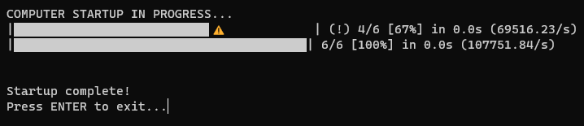

# Startup Complete

*Simple command line tool to let you know when your PC's ready to go.*

### Features
- A simple command line tool that lets you know when your CPU load has been below the pre-set percentage for the pre-set amount of time.
- The app shows the name of your computer in the opening message.
- The app ends with a pause so you know whether the app has already ran or not when you've let your computer turn on while being AFK.
- There are two pre-made versions available:
    - desktop - time: 6s - load: <20%
    - laptop - time: 6s - load: <30%
- You can make your own version by downloading the .py source file and editing the constants IDLE_TIME and IDLE_LOAD (optionally, also runnning it through pyinstaller to get .exe file).

### How to...
**Install:**
- Either download and run the .exe file or download the .py source code.
- To use the app to its full potential, make a shortcut in the Startup folder ("C:\ProgramData\Microsoft\Windows\Start Menu\Programs\Startup")

**Remove:**
- Simply delete the .exe or .py file.
- If you made a shortcut in the Startup folder, don't forget to delete that as well.

**Update:**
- Simply replace the .exe or .py file with the new version.
- Unless the name changed from the last version, you don't need to change the shortcut in the Startup folder in any way.
- Note: I don't plan on making any updates unless a bug pops up or something...

### Known Bugs
- None yet... Report them [here](https://github.com/FTEdianiaK/startup-complete/issues).

### Credits
**Libraries used in code:**
- [subprocess, platform - from Python Standard Library - PSF](https://docs.python.org/3/library/index.html)
- [alive-progress - by Rogério Sampaio de Almeida - MIT]()

**Other used libraries:**
- [pyinstaller - by Hartmut Goebel, Giovanni Bajo, David Vierra, David Cortesi, Martin Zibricky - GPLv2](https://pypi.org/project/pyinstaller/)
- [pycodestyle - by Johann C. Rocholl - MIT](https://pypi.org/project/pycodestyle/)
